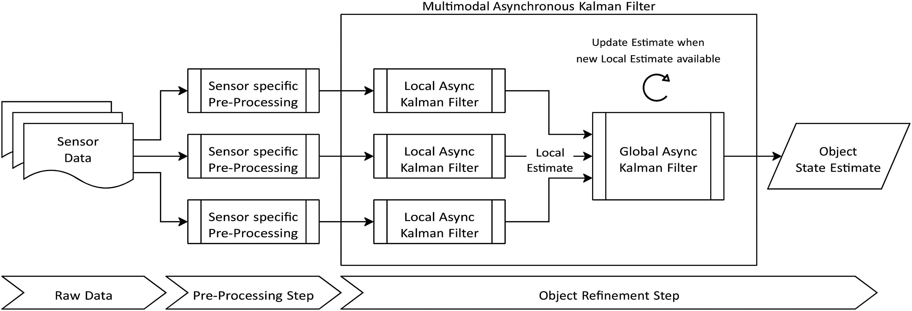

# Multimodal Asynchronous Kalman Filter (MAKF)

This repository contains the code for our paper:

**Multimodal Asynchronous Kalman Filter for Monitoring Unstable Rock Slopes**  
*Lukas Schild, Thomas Scheiber, Paula Snook, Reza Arghandeh, Stig Frode Samnøy, Alexander Maschler, et al.*  
Published in *Geomatics, Natural Hazards and Risk*, Volume 14, Issue 1, 2023  
DOI: [10.1080/19475705.2023.2272575](https://doi.org/10.1080/19475705.2023.2272575)

## Summary

This paper proposes a **Multimodal Asynchronous Kalman Filter (MAKF)** for fusing heterogeneous sensor data to monitor unstable rock slopes. The method uses a two-stage architecture: multiple **local Kalman Filters** (one per sensor) compute estimates at each sensor's native sampling rate (asynchronously to allow for mssing/corrupted measurements), which are then combined by a **global Kalman Filter** that synchronizes the outputs.

## Structure

The `data` directory contains all data used in the paper and is necessary to run the demo file.

[MAKF_demo.ipynb](MAKF_demo.ipynb) contains a detailed explanation of the data-preprocessing and the application of the filters.

[asynchronous_kalman_filter.jl](asynchronous_kalman_filter.jl) contains the implementation of a Kalman Filter processing the measurements for the different sources (sensors). 

The files [extensometer_pre.jl](extensometer_pre.jl) and [totalstation_utils.jl](extensometer_utils.jl) contain pre-processing code related to the Extensometer and Total Station data repsectively.
